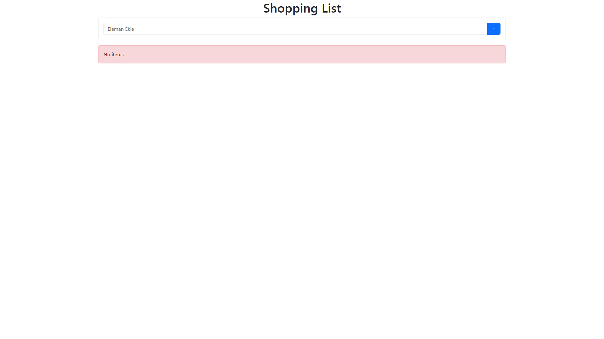
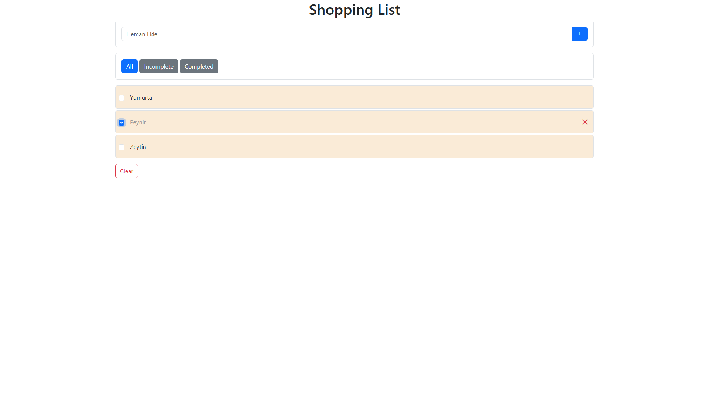

**🛒 Shopping List App**

A simple and functional Shopping List application built using JavaScript DOM, event handling, and localStorage.
Users can add, edit, delete, filter, and save items — even after refreshing the page.

---

**🚀 Features**

➕ Add new items

✏️ Edit items (inline editing)

✔️ Mark items as completed

❌ Delete items

🎚 Filter by: All / Completed / Incomplete

💾 Auto-save using localStorage

🧹 Clear all items

🎨 Responsive and simple UI (Bootstrap 5)

---

**🖼 Screenshots**

### 🧼 Empty State

### 🛍 Filled List

---

**⚙️ Technologies Used**

 
  
   
  
  
  

